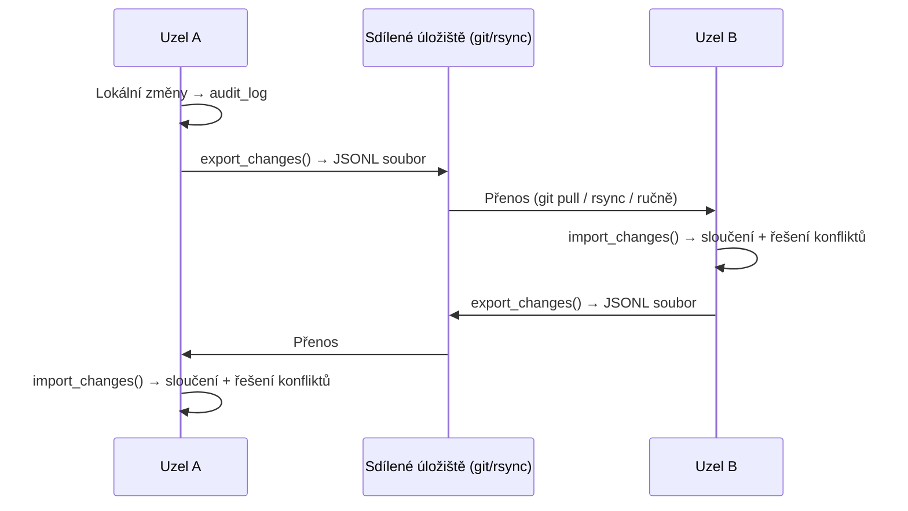
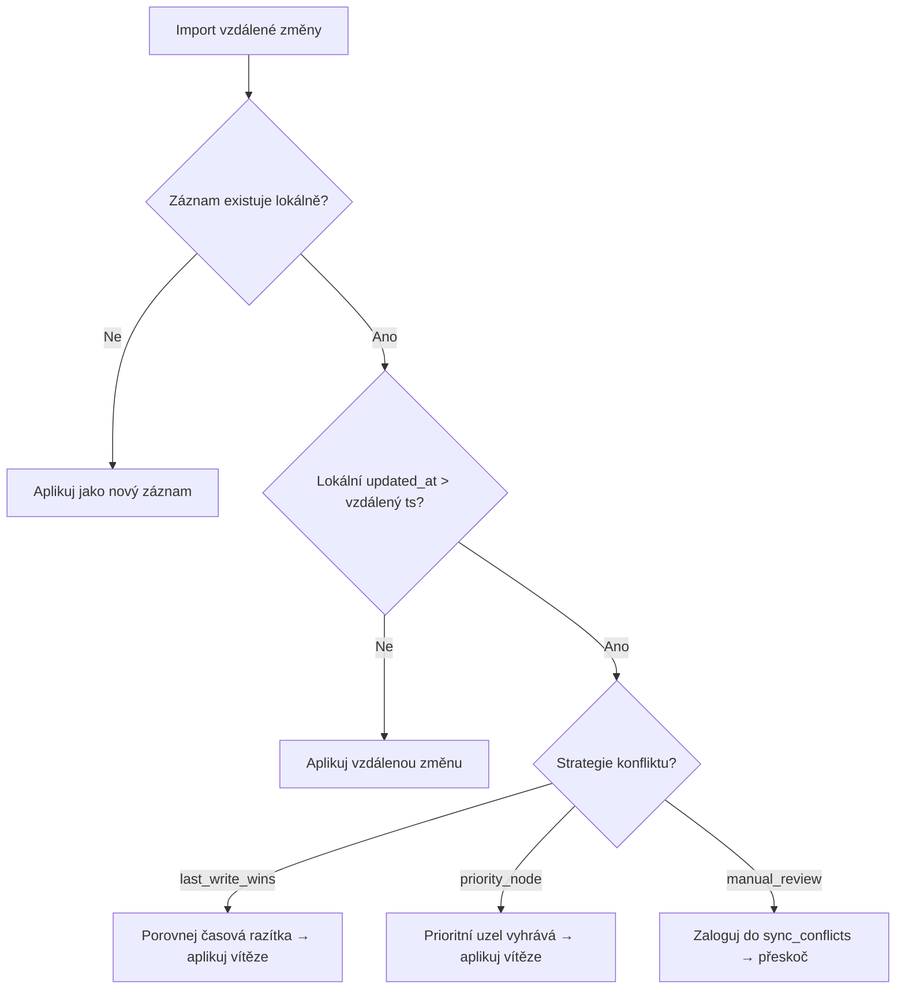

> ⚠️ **DESIGN ONLY** — This module is not implemented. This document describes a planned design.

# UAML SyncEngine — Architektura a návrh

> Distribuovaná synchronizace týmů s podporou offline režimu, RBAC filtrováním a git-kompatibilními JSONL changelogy.

## Přehled

SyncEngine řeší zásadní problém — jak udržet více UAML uzlů synchronizovaných napříč distribuovaným týmem, a to i v situacích, kdy jsou uzly offline. V reálných nasazeních běží AI agenti na různých strojích (VPS servery, notebooky vývojářů, edge zařízení), přičemž každý si udržuje lokální SQLite databázi přes `MemoryStore`. Tyto uzly potřebují sdílet znalosti, úkoly, artefakty a entitní data — bez centrálního serveru.

**Klíčová designová rozhodnutí:**

- **Žádný centrální server** — uzly si vyměňují JSONL changelog soubory přímo (přes git, rsync, USB nebo jakýkoli transport)
- **Offline-first** — změny se hromadí lokálně; synchronizace proběhne při obnovení konektivity
- **Git-friendly** — JSONL soubory jsou prostý text, řádkové, diffovatelné a mergovatelné
- **RBAC na datové vrstvě** — identitní data se NIKDY nesynchronizují; osobní data vyžadují explicitní souhlas
- **Multi-tabulková synchronizace** — 8 různých typů tabulek v jedné operaci

## Architektura

```
┌─────────────────────┐                      ┌─────────────────────┐
│   Uzel A (Metod)    │                      │   Uzel B (Cyril)    │
│                     │   JSONL changelog    │                     │
│  MemoryStore (SQLite│ ──────────────────►  │  MemoryStore (SQLite│
│  + audit_log)       │                      │  + audit_log)       │
│                     │  ◄──────────────────  │                     │
│  SyncEngine         │   JSONL changelog    │  SyncEngine         │
│  ├─ export_changes()│                      │  ├─ import_changes()│
│  ├─ import_changes()│                      │  ├─ export_changes()│
│  └─ full_export()   │                      │  └─ full_import()   │
└─────────────────────┘                      └─────────────────────┘
```

### Režimy synchronizace

| Režim | Metoda | Případ použití |
|-------|--------|----------------|
| **Delta sync** | `export_changes()` / `import_changes()` | Běžná inkrementální synchronizace — pouze změny od posledního syncu |
| **Plný sync** | `full_export()` / `full_import()` | Inicializace nového uzlu, disaster recovery |
| **Lock intent sync** | `export_lock_intents()` / `import_lock_intents()` | Distribuovaný protokol pro zamykání úkolů (viz [Task Claim Protocol](task-claim-protocol.md)) |

### Tok dat



## Základní třídy

### SyncEngine

Hlavní orchestrátor. Připojuje se k `MemoryStore`, čte z `audit_log` a vytváří/zpracovává JSONL changelogy.

```python
from uaml import MemoryStore
from uaml.sync import SyncEngine, ConflictResolver

store = MemoryStore("memory.db")
engine = SyncEngine(
    store=store,
    node_id="metod-vps",
    sync_dir="sync/",
    conflict_resolver=ConflictResolver(strategy="last_write_wins"),
)
```

### ChangeEntry

Jeden záznam změny v JSONL changelogu. Obsahuje ID změny, zdrojový uzel, časové razítko, typ akce, cílový záznam, datový obsah, kontrolní součet integrity a cílovou tabulku.

```python
@dataclass
class ChangeEntry:
    id: str           # UUID — unikátní identifikátor změny
    node_id: str      # Zdrojový uzel (např. "metod-vps")
    timestamp: str    # ISO 8601 UTC časové razítko
    action: str       # learn | update | delete | tag | link
    entry_id: int     # ID řádku v zdrojové tabulce
    data: dict        # Datový obsah sloupců
    checksum: str     # SHA-256 dat (ověření integrity)
    table: str        # Název cílové tabulky (výchozí: "knowledge")
```

### ConflictResolver

Řeší slučovací konflikty, kdy byl stejný záznam upraven na více uzlech.

```python
resolver = ConflictResolver(
    strategy="last_write_wins",    # nebo "priority_node" či "manual_review"
    priority_node="metod-vps",     # povinné pro strategii priority_node
)
winner = resolver.resolve(local_change, remote_change)
```

### SyncFilter

RBAC filtr, který omezuje, které řádky jsou zahrnuty do synchronizačních operací. Vynucuje pevné bezpečnostní invarianty na datové vrstvě.

### SyncProfile

Pojmenovaná konfigurace kombinující `SyncFilter`, směr synchronizace a strategii řešení konfliktů do znovupoužitelného profilu.

## Multi-tabulková synchronizace

SyncEngine podporuje 8 tabulek. Každá tabulka má definovanou sadu sloupců, které se serializují do JSONL changelogu:

| Tabulka | Popis | Klíčové sloupce |
|---------|-------|-----------------|
| `knowledge` | Jádro znalostní báze — fakta, poznámky, rozhodnutí | content, topic, tags, summary, confidence, data_layer, project |
| `source_links` | Provenienční vazby mezi znalostními záznamy | source_id, target_id, link_type, confidence |
| `artifacts` | Soubory, dokumenty, generované výstupy | name, artifact_type, path, status, project, checksum |
| `tasks` | Úkoly/TODO s trasováním stavu | title, description, status, project, assigned_to, priority, due_date |
| `entities` | Pojmenované entity extrahované ze znalostí | name, entity_type, properties |
| `entity_mentions` | Vazby mezi entitami a znalostními záznamy | entity_id, entry_id, mention_type |
| `knowledge_relations` | Sémantické vztahy mezi znalostními záznamy | source_id, target_id, relation_type, confidence |
| `session_summaries` | Shrnutí agentních relací | session_id, agent_id, summary, message_count |

### Konfigurace sloupců

Serializují se pouze explicitně uvedené sloupce. Primární klíče, automaticky generovaná časová razítka a interní pole jsou z changelogu vyloučeny, aby se předešlo kolizím ID napříč uzly.

```python
from uaml.sync import TABLE_COLUMNS, ALL_SYNC_TABLES

# Zobrazení všech synchronizovatelných tabulek
print(ALL_SYNC_TABLES)
# ['knowledge', 'source_links', 'artifacts', 'tasks', 'entities',
#  'entity_mentions', 'knowledge_relations', 'session_summaries']

# Sloupce pro konkrétní tabulku
print(TABLE_COLUMNS["tasks"])
# ['title', 'description', 'status', 'project', 'assigned_to',
#  'priority', 'tags', 'due_date', 'parent_id', 'client_ref',
#  'data_layer', 'completed_at']
```

## RBAC filtrování

SyncEngine vynucuje řízení přístupu na základě rolí (RBAC) na datové vrstvě. Toto není volitelné — je to zabudováno přímo do export/import pipeline.

### Bezpečnostní invarianty (nepřekonatelné)

1. **Identitní data se NIKDY nesynchronizují.** Záznamy s `data_layer='identity'` jsou bezpodmínečně vyloučeny ze všech exportů. Žádný profil, žádný příznak, žádný parametr to nemůže přepsat.
2. **Osobní data vyžadují explicitní souhlas.** Záznamy s `data_layer='personal'` jsou vyloučeny, pokud není `"personal"` explicitně uvedeno v `allowed_layers`.

### Dimenze filtrování

| Filtr | Platné tabulky | Chování |
|-------|----------------|---------|
| `allowed_layers` | knowledge, tasks, artifacts | Projdou pouze řádky s odpovídající `data_layer` |
| `allowed_topics` | knowledge | Projdou pouze řádky s odpovídajícím `topic` |
| `allowed_agents` | knowledge, session_summaries | Projdou pouze řádky s odpovídajícím `agent_id` |
| `allowed_tags` | knowledge, tasks | Řádek musí mít alespoň jeden odpovídající tag (čárkami oddělené) |

### Příklady filtrů

```python
from uaml.sync import SyncFilter

# Export pouze projektových dat pro konkrétní téma
project_filter = SyncFilter(
    allowed_layers=["knowledge", "project"],
    allowed_topics=["infrastructure", "deployment"],
)

# Export všeho kromě identity/personal (celotýmový)
team_filter = SyncFilter(
    allowed_layers=["knowledge", "team", "operational", "project"],
)

# Omezení na výstup konkrétního agenta
agent_filter = SyncFilter(
    allowed_agents=["cyril-notebook"],
    allowed_layers=["knowledge", "team"],
)
```

## Synchronizační profily

Předdefinované profily pro běžné týmové konfigurace:

| Profil | Směr | Vrstvy | Případ použití |
|--------|------|--------|----------------|
| **ADMIN** | Obousměrný | knowledge, team, operational, project, personal | Plný administrátorský přístup — včetně osobních dat s opt-inem |
| **TEAM_FULL** | Obousměrný | knowledge, team, operational, project | Standardní člen týmu — čte i zapisuje sdílená data |
| **TEAM_READONLY** | Pouze import | knowledge, team, operational, project | Pozorovatelská role — přijímá aktualizace, nemůže odesílat změny |
| **EXTERNAL_PARTNER** | Pouze export | knowledge, project | Externí spolupracovník — dostává pouze kurátorská projektová data |

### Použití

```python
from uaml.sync import SyncEngine, ADMIN, TEAM_FULL, TEAM_READONLY, EXTERNAL_PARTNER

# Člen týmu synchronizuje obousměrně
path = engine.export_changes(sync_profile=TEAM_FULL)
result = engine.import_changes("incoming.jsonl", sync_profile=TEAM_FULL)

# Externí partner dostane filtrovaný export (import zablokován profilem)
path = engine.export_changes(sync_profile=EXTERNAL_PARTNER)

# Readonly uzel může pouze importovat
result = engine.import_changes("updates.jsonl", sync_profile=TEAM_READONLY)
# engine.export_changes(sync_profile=TEAM_READONLY)  # ← vyhodí ValueError
```

### Vlastní profily

```python
from uaml.sync import SyncProfile, SyncFilter

# Vlastní: synchronizace pouze úkolů se štítkem "sprint-42" pro konkrétní projekt
sprint_sync = SyncProfile(
    name="sprint-42",
    filter=SyncFilter(
        allowed_layers=["project", "operational"],
        allowed_tags=["sprint-42"],
    ),
    direction="bidirectional",
    conflict_strategy="priority_node",
)
```

## JSONL formát

Každý řádek v changelog souboru je samostatný JSON objekt:

```json
{"id": "a1b2c3d4-e5f6-7890-abcd-ef1234567890", "node": "metod-vps", "ts": "2026-03-14T10:30:00+00:00", "action": "learn", "entry_id": 42, "data": {"content": "VPS záloha běží denně ve 03:00 UTC", "topic": "infrastructure", "tags": "backup,ops", "confidence": 0.95, "data_layer": "operational"}, "checksum": "e3b0c44298fc1c149afbf4c8996fb92427ae41e4649b934ca495991b7852b855"}
{"id": "f7e8d9c0-b1a2-3456-7890-abcdef123456", "node": "metod-vps", "ts": "2026-03-14T10:31:00+00:00", "action": "update", "entry_id": 17, "data": {"content": "Aktualizovaná procedura nasazení", "tags": "deploy,v2"}, "checksum": "abc123...", "table": "knowledge"}
{"id": "11223344-5566-7788-99aa-bbccddeeff00", "node": "metod-vps", "ts": "2026-03-14T10:32:00+00:00", "action": "learn", "entry_id": 5, "data": {"title": "Opravit obnovu SSL certifikátu", "status": "open", "priority": "high"}, "checksum": "def456...", "table": "tasks"}
```

### Popis polí

| Pole | Typ | Popis |
|------|-----|-------|
| `id` | string (UUID) | Unikátní identifikátor záznamu změny |
| `node` | string | ID zdrojového uzlu |
| `ts` | string (ISO 8601) | Časové razítko vzniku změny |
| `action` | string | Jedna z: `learn`, `update`, `delete`, `tag`, `link` |
| `entry_id` | integer | ID řádku ve zdrojové tabulce |
| `data` | object | Hodnoty sloupců (liší se podle tabulky a akce) |
| `checksum` | string | SHA-256 hash `data` pro ověření integrity |
| `table` | string | Název cílové tabulky (vynechává se pro `"knowledge"` — zpětná kompatibilita) |

### Konvence pojmenování souborů

- Delta export: `{node_id}_{ISO_timestamp}.jsonl`
- Plný export: `{node_id}_full_{ISO_timestamp}.jsonl`
- Lock intenty: `{node_id}_locks_{ISO_timestamp}.jsonl`

Příklad: `metod-vps_2026-03-14T10-30-00+00-00.jsonl`

## Řešení konfliktů

Když je stejný záznam upraven na více uzlech mezi synchronizacemi, SyncEngine detekuje konflikt a aplikuje jednu ze tří strategií:

### Strategie

| Strategie | Chování | Vhodné pro |
|-----------|---------|------------|
| `last_write_wins` | Vyhrává novější časové razítko (lexikografické porovnání ISO 8601) | Většinu týmů — jednoduché, předvídatelné |
| `priority_node` | Určený uzel vždy vyhrává; ostatní uzly spadají na last-write-wins | Autoritativní zdroj (např. VPS je pravda) |
| `manual_review` | Konflikt se zaloguje do tabulky `sync_conflicts`; žádná verze se neaplikuje | Regulovaná prostředí, požadavky na audit |

### Detekce konfliktů

Konflikt se detekuje během `import_changes()`, když:

1. Vzdálená změna cílí na záznam, který existuje lokálně
2. Lokální `updated_at` záznamu je novější než časové razítko vzdálené změny



### Log konfliktů

Všechny konflikty (vyřešené i čekající) se ukládají do tabulky `sync_conflicts`:

```sql
CREATE TABLE sync_conflicts (
    id INTEGER PRIMARY KEY AUTOINCREMENT,
    local_entry_id INTEGER,
    remote_entry_id INTEGER,
    local_data TEXT,       -- JSON lokální verze
    remote_data TEXT,      -- JSON vzdálené verze
    resolution TEXT,       -- "resolved:node_id" nebo "pending"
    resolved_at TEXT       -- ISO 8601 nebo NULL pro čekající
);
```

## API reference

### SyncEngine

| Metoda | Signatura | Popis |
|--------|-----------|-------|
| `__init__` | `(store: MemoryStore, node_id: str, sync_dir: str = "sync/", conflict_resolver: Optional[ConflictResolver] = None)` | Inicializace s úložištěm, identitou uzlu, výstupním adresářem a volitelným resolverem |
| `export_changes` | `(since: Optional[str] = None, *, tables: Optional[list[str]] = None, sync_filter: Optional[SyncFilter] = None, sync_profile: Optional[SyncProfile] = None) → str` | Export delta changelogu od časového razítka. Vrací cestu k souboru |
| `import_changes` | `(filepath: str, *, tables: Optional[list[str]] = None, sync_filter: Optional[SyncFilter] = None, sync_profile: Optional[SyncProfile] = None) → dict` | Import JSONL changelogu. Vrací `{"applied": N, "conflicts": N, "skipped": N}` |
| `full_export` | `(*, tables: Optional[list[str]] = None, sync_filter: Optional[SyncFilter] = None) → str` | Export celých tabulek jako JSONL. Vrací cestu k souboru |
| `full_import` | `(filepath: str) → dict` | Import plného exportu (bez detekce konfliktů). Vrací `{"applied": N, "conflicts": 0, "skipped": N}` |
| `export_lock_intents` | `(since: Optional[str] = None) → str` | Export lock intentů jako JSONL. Vrací cestu k souboru |
| `import_lock_intents` | `(filepath: str) → dict` | Import lock intentů s detekcí konfliktů. Vrací detailní výsledek |
| `get_last_sync` | `(remote_node: Optional[str] = None) → Optional[str]` | Získání časového razítka posledního syncu pro uzel (nebo nejnovějšího napříč všemi) |
| `set_last_sync` | `(remote_node: str, timestamp: str) → None` | Záznam časového razítka posledního syncu pro vzdálený uzel |

### ChangeEntry

| Metoda | Signatura | Popis |
|--------|-----------|-------|
| `compute_checksum` | `(data: dict) → str` | Statická: výpočet SHA-256 kontrolního součtu datového slovníku |
| `verify_checksum` | `() → bool` | Ověření, zda uložený checksum odpovídá datům |
| `to_jsonl` | `() → str` | Serializace do jednoho JSONL řádku |
| `from_json` | `(obj: dict) → ChangeEntry` | Třídní metoda: deserializace z parsovaného JSONu |

### ConflictResolver

| Metoda | Signatura | Popis |
|--------|-----------|-------|
| `__init__` | `(strategy: str = "last_write_wins", priority_node: Optional[str] = None)` | Inicializace se strategií a volitelným prioritním uzlem |
| `resolve` | `(local: ChangeEntry, remote: ChangeEntry) → ChangeEntry` | Vyřešení konfliktu, vrací vítězný záznam |

### SyncFilter

| Metoda | Signatura | Popis |
|--------|-----------|-------|
| `__init__` | `(allowed_layers, allowed_topics, allowed_agents, allowed_tags: vše Optional[list[str]])` | Inicializace filtru s volitelnými omezeními dimenzí |
| `accepts` | `(row: dict, table: str) → bool` | Vrací True, pokud řádek projde všemi podmínkami filtru |

### SyncProfile

| Metoda | Signatura | Popis |
|--------|-----------|-------|
| `__init__` | `(name: str, filter: SyncFilter, direction: str = "bidirectional", conflict_strategy: str = "last_write_wins")` | Inicializace profilu |
| `allows_export` | `() → bool` | True, pokud směr povoluje exporty |
| `allows_import` | `() → bool` | True, pokud směr povoluje importy |

## Příklady použití

### Základní synchronizace mezi dvěma uzly

```python
from uaml import MemoryStore
from uaml.sync import SyncEngine

# Uzel A: Metod (VPS)
store_a = MemoryStore("metod_memory.db")
engine_a = SyncEngine(store_a, node_id="metod-vps", sync_dir="sync/")

# Uzel B: Cyril (notebook)
store_b = MemoryStore("cyril_memory.db")
engine_b = SyncEngine(store_b, node_id="cyril-notebook", sync_dir="sync/")

# Metod exportuje změny
changelog = engine_a.export_changes()
# → "sync/metod-vps_2026-03-14T10-30-00+00-00.jsonl"

# Cyril je importuje
result = engine_b.import_changes(changelog)
print(result)
# {"applied": 12, "conflicts": 0, "skipped": 1}

# Cyril exportuje svoje změny
changelog_b = engine_b.export_changes()

# Metod importuje Cyrilovy změny
result_a = engine_a.import_changes(changelog_b)
```

### Filtrovaný export pro externího partnera

```python
from uaml.sync import SyncEngine, EXTERNAL_PARTNER

# Export pouze projektových znalostí pro externího spolupracovníka
path = engine.export_changes(sync_profile=EXTERNAL_PARTNER)
# Soubor obsahuje pouze řádky s data_layer='knowledge' nebo 'project'
# Identitní a osobní data jsou kompletně vyloučena
```

### Plná počáteční synchronizace (nastavení nového uzlu)

```python
# Na zdrojovém uzlu (Metod): export všeho
full_path = engine_a.full_export(
    tables=["knowledge", "tasks", "artifacts"],
    sync_filter=SyncFilter(allowed_layers=["knowledge", "team", "operational", "project"]),
)

# Přenesení souboru na nový uzel...
# Na novém uzlu (Cyril): import plného exportu
result = engine_b.full_import(full_path)
print(result)
# {"applied": 847, "conflicts": 0, "skipped": 3}
```

### Selektivní synchronizace tabulek

```python
# Synchronizace pouze úkolů a artefaktů
path = engine.export_changes(tables=["tasks", "artifacts"])
result = engine.import_changes("incoming.jsonl", tables=["tasks", "artifacts"])
```

## Bezpečnostní aspekty

### Ochrana identitní vrstvy

Kontrola `data_layer='identity'` je vynucena v `SyncFilter.accepts()` ještě předtím, než jakákoli data opustí uzel. Jedná se o pevně zakódovaný invariant — nekonfigurovatelný, nepřekonatelný. Identitní data (přihlašovací údaje, osobní identifikátory, přístupové tokeny) se nikdy neobjeví v žádném JSONL changelogu.

### Opt-in pro osobní data

Osobní data (`data_layer='personal'`) jsou ve výchozím stavu blokována. I profil ADMIN musí explicitně zahrnout `"personal"` do `allowed_layers`. To zajišťuje GDPR-kompatibilní výchozí nastavení — osobní data proudí pouze při záměrném rozhodnutí je sdílet.

### Integrita kontrolních součtů

Každý `ChangeEntry` nese SHA-256 kontrolní součet svého datového obsahu. Při importu se pro každý záznam volá `verify_checksum()`. Záznamy s neodpovídajícím kontrolním součtem se tiše přeskočí — indikují poškození nebo manipulaci při přenosu.

```python
# Kontrolní součet se počítá z kanonické JSON reprezentace
raw = json.dumps(data, sort_keys=True, ensure_ascii=False)
checksum = hashlib.sha256(raw.encode("utf-8")).hexdigest()
```

### Deduplikace

Importní pipeline deduplikuje záznamy pomocí hashování obsahu pro `learn` akce. Pokud záznam se stejným `content_hash` již existuje v lokální databázi, import ho přeskočí. To zabraňuje duplikaci při překrývajících se synchronizačních oknech nebo opakovaných importech.

### Auditní stopa synchronizace

Všechny synchronizační operace se zaznamenávají do tabulky `sync_log`:

```sql
CREATE TABLE sync_log (
    id INTEGER PRIMARY KEY AUTOINCREMENT,
    node_id TEXT NOT NULL,
    direction TEXT NOT NULL,        -- 'export' nebo 'import'
    timestamp TEXT NOT NULL,
    entries_count INTEGER DEFAULT 0,
    conflicts_count INTEGER DEFAULT 0
);
```

To poskytuje kompletní auditní stopu — co se synchronizovalo, kdy a s kým.

---

© 2026 GLG, a.s. All rights reserved.
