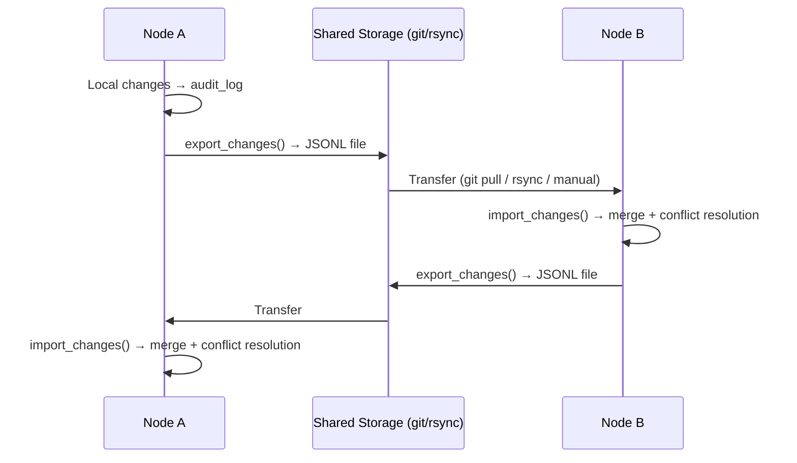
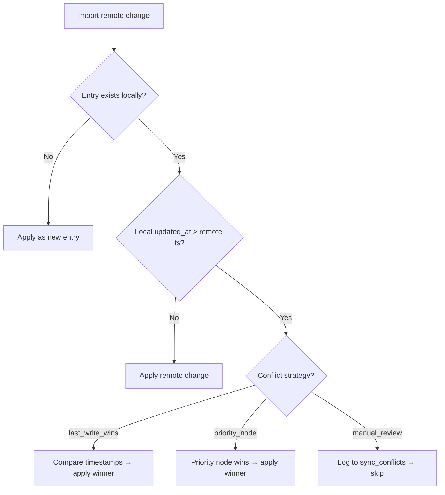

> ⚠️ **DESIGN ONLY** — This module is not implemented. This document describes a planned design.

# UAML SyncEngine — Architecture & Design

> Distributed team synchronization with offline support, RBAC filtering, and git-friendly JSONL changelogs.

## Overview

SyncEngine solves the fundamental challenge of keeping multiple UAML nodes in sync across distributed teams — even when nodes go offline. In real-world deployments, AI agents run on different machines (VPS servers, developer notebooks, edge devices), each maintaining a local SQLite database via `MemoryStore`. These nodes need to share knowledge, tasks, artifacts, and entity data without a central server.

**Key design decisions:**

- **No central server** — nodes exchange JSONL changelog files directly (via git, rsync, USB, or any transport)
- **Offline-first** — changes accumulate locally; sync happens when connectivity is available
- **Git-friendly** — JSONL files are plain text, line-based, diffable, and mergeable
- **RBAC at the data layer** — identity data is NEVER synced; personal data requires explicit opt-in
- **Multi-table** — syncs 8 different table types in a single operation

## Architecture

```
┌─────────────────────┐                      ┌─────────────────────┐
│   Node A (Metod)    │                      │  Node B (Cyril)     │
│                     │   JSONL changelog    │                     │
│  MemoryStore (SQLite│ ──────────────────►  │  MemoryStore (SQLite│
│  + audit_log)       │                      │  + audit_log)       │
│                     │  ◄──────────────────  │                     │
│  SyncEngine         │   JSONL changelog    │  SyncEngine         │
│  ├─ export_changes()│                      │  ├─ import_changes()│
│  ├─ import_changes()│                      │  ├─ export_changes()│
│  └─ full_export()   │                      │  └─ full_import()   │
└─────────────────────┘                      └─────────────────────┘
```

### Sync Modes

| Mode | Method | Use Case |
|------|--------|----------|
| **Delta sync** | `export_changes()` / `import_changes()` | Regular incremental sync — only changes since last sync |
| **Full sync** | `full_export()` / `full_import()` | Initial setup of a new node, disaster recovery |
| **Lock intent sync** | `export_lock_intents()` / `import_lock_intents()` | Distributed task claim protocol (see [Task Claim Protocol](task-claim-protocol.md)) |

### Data Flow



## Core Classes

### SyncEngine

The main orchestrator. Connects to a `MemoryStore`, reads from `audit_log`, and produces/consumes JSONL changelogs.

```python
from uaml import MemoryStore
from uaml.sync import SyncEngine, ConflictResolver

store = MemoryStore("memory.db")
engine = SyncEngine(
    store=store,
    node_id="metod-vps",
    sync_dir="sync/",
    conflict_resolver=ConflictResolver(strategy="last_write_wins"),
)
```

### ChangeEntry

A single change record in a JSONL changelog. Contains the change ID, originating node, timestamp, action type, target entry, data payload, integrity checksum, and target table.

```python
@dataclass
class ChangeEntry:
    id: str           # UUID — unique change identifier
    node_id: str      # Originating node (e.g., "metod-vps")
    timestamp: str    # ISO 8601 UTC timestamp
    action: str       # learn | update | delete | tag | link
    entry_id: int     # Target row ID in the source table
    data: dict        # Column data payload
    checksum: str     # SHA-256 of data (integrity verification)
    table: str        # Target table name (default: "knowledge")
```

### ConflictResolver

Handles merge conflicts when the same entry was modified on multiple nodes.

```python
resolver = ConflictResolver(
    strategy="last_write_wins",    # or "priority_node" or "manual_review"
    priority_node="metod-vps",     # required for priority_node strategy
)
winner = resolver.resolve(local_change, remote_change)
```

### SyncFilter

RBAC filter that restricts which rows are included in sync operations. Enforces hard security invariants at the data layer.

### SyncProfile

Named configuration combining a `SyncFilter`, sync direction, and conflict strategy into a reusable profile.

## Multi-Table Sync

SyncEngine supports 8 tables. Each table has a defined set of columns that are serialized into the JSONL changelog:

| Table | Description | Key Columns |
|-------|-------------|-------------|
| `knowledge` | Core knowledge entries — facts, notes, decisions | content, topic, tags, summary, confidence, data_layer, project |
| `source_links` | Provenance links between knowledge entries | source_id, target_id, link_type, confidence |
| `artifacts` | Files, documents, generated outputs | name, artifact_type, path, status, project, checksum |
| `tasks` | Task/TODO items with status tracking | title, description, status, project, assigned_to, priority, due_date |
| `entities` | Named entities extracted from knowledge | name, entity_type, properties |
| `entity_mentions` | Links between entities and knowledge entries | entity_id, entry_id, mention_type |
| `knowledge_relations` | Semantic relationships between knowledge entries | source_id, target_id, relation_type, confidence |
| `session_summaries` | Agent session summaries | session_id, agent_id, summary, message_count |

### Column Configuration

Only explicitly listed columns are serialized. Primary keys, auto-generated timestamps, and internal fields are excluded from the changelog to prevent ID conflicts across nodes.

```python
from uaml.sync import TABLE_COLUMNS, ALL_SYNC_TABLES

# See all syncable tables
print(ALL_SYNC_TABLES)
# ['knowledge', 'source_links', 'artifacts', 'tasks', 'entities',
#  'entity_mentions', 'knowledge_relations', 'session_summaries']

# See columns for a specific table
print(TABLE_COLUMNS["tasks"])
# ['title', 'description', 'status', 'project', 'assigned_to',
#  'priority', 'tags', 'due_date', 'parent_id', 'client_ref',
#  'data_layer', 'completed_at']
```

## RBAC Filtering

SyncEngine enforces Role-Based Access Control at the data layer. This is not optional — it's baked into the export/import pipeline.

### Security Invariants (Non-Overridable)

1. **Identity data is NEVER synced.** Entries with `data_layer='identity'` are unconditionally excluded from all exports. No profile, no flag, no parameter can override this.
2. **Personal data requires explicit opt-in.** Entries with `data_layer='personal'` are excluded unless `"personal"` is explicitly listed in `allowed_layers`.

### Filter Dimensions

| Filter | Applicable Tables | Behavior |
|--------|------------------|----------|
| `allowed_layers` | knowledge, tasks, artifacts | Only rows with matching `data_layer` pass |
| `allowed_topics` | knowledge | Only rows with matching `topic` pass |
| `allowed_agents` | knowledge, session_summaries | Only rows with matching `agent_id` pass |
| `allowed_tags` | knowledge, tasks | Row must have at least one matching tag (comma-separated) |

### Filter Examples

```python
from uaml.sync import SyncFilter

# Export only project-level data for a specific topic
project_filter = SyncFilter(
    allowed_layers=["knowledge", "project"],
    allowed_topics=["infrastructure", "deployment"],
)

# Export everything except identity/personal (team-wide)
team_filter = SyncFilter(
    allowed_layers=["knowledge", "team", "operational", "project"],
)

# Restrict to a specific agent's output
agent_filter = SyncFilter(
    allowed_agents=["cyril-notebook"],
    allowed_layers=["knowledge", "team"],
)
```

## Sync Profiles

Pre-built profiles for common team configurations:

| Profile | Direction | Layers | Use Case |
|---------|-----------|--------|----------|
| **ADMIN** | Bidirectional | knowledge, team, operational, project, personal | Full admin access — includes personal data with opt-in |
| **TEAM_FULL** | Bidirectional | knowledge, team, operational, project | Standard team member — reads and writes shared data |
| **TEAM_READONLY** | Import only | knowledge, team, operational, project | Observer role — receives updates, cannot push changes |
| **EXTERNAL_PARTNER** | Export only | knowledge, project | External collaborator — receives curated project data only |

### Usage

```python
from uaml.sync import SyncEngine, ADMIN, TEAM_FULL, TEAM_READONLY, EXTERNAL_PARTNER

# Team member syncs bidirectionally
path = engine.export_changes(sync_profile=TEAM_FULL)
result = engine.import_changes("incoming.jsonl", sync_profile=TEAM_FULL)

# External partner gets a filtered export (import blocked by profile)
path = engine.export_changes(sync_profile=EXTERNAL_PARTNER)

# Readonly node can only import
result = engine.import_changes("updates.jsonl", sync_profile=TEAM_READONLY)
# engine.export_changes(sync_profile=TEAM_READONLY)  # ← raises ValueError
```

### Custom Profiles

```python
from uaml.sync import SyncProfile, SyncFilter

# Custom: only sync tasks tagged "sprint-42" for a specific project
sprint_sync = SyncProfile(
    name="sprint-42",
    filter=SyncFilter(
        allowed_layers=["project", "operational"],
        allowed_tags=["sprint-42"],
    ),
    direction="bidirectional",
    conflict_strategy="priority_node",
)
```

## JSONL Format

Each line in a changelog file is a self-contained JSON object:

```json
{"id": "a1b2c3d4-e5f6-7890-abcd-ef1234567890", "node": "metod-vps", "ts": "2026-03-14T10:30:00+00:00", "action": "learn", "entry_id": 42, "data": {"content": "VPS backup runs daily at 03:00 UTC", "topic": "infrastructure", "tags": "backup,ops", "confidence": 0.95, "data_layer": "operational"}, "checksum": "e3b0c44298fc1c149afbf4c8996fb92427ae41e4649b934ca495991b7852b855"}
{"id": "f7e8d9c0-b1a2-3456-7890-abcdef123456", "node": "metod-vps", "ts": "2026-03-14T10:31:00+00:00", "action": "update", "entry_id": 17, "data": {"content": "Updated deployment procedure", "tags": "deploy,v2"}, "checksum": "abc123...", "table": "knowledge"}
{"id": "11223344-5566-7788-99aa-bbccddeeff00", "node": "metod-vps", "ts": "2026-03-14T10:32:00+00:00", "action": "learn", "entry_id": 5, "data": {"title": "Fix SSL cert renewal", "status": "open", "priority": "high"}, "checksum": "def456...", "table": "tasks"}
```

### Field Descriptions

| Field | Type | Description |
|-------|------|-------------|
| `id` | string (UUID) | Unique identifier for this change entry |
| `node` | string | Originating node ID |
| `ts` | string (ISO 8601) | Timestamp when the change occurred |
| `action` | string | One of: `learn`, `update`, `delete`, `tag`, `link` |
| `entry_id` | integer | Row ID in the source table |
| `data` | object | Column values (varies by table and action) |
| `checksum` | string | SHA-256 hash of `data` for integrity verification |
| `table` | string | Target table name (omitted if `"knowledge"` — backward compatibility) |

### File Naming Convention

- Delta export: `{node_id}_{ISO_timestamp}.jsonl`
- Full export: `{node_id}_full_{ISO_timestamp}.jsonl`
- Lock intents: `{node_id}_locks_{ISO_timestamp}.jsonl`

Example: `metod-vps_2026-03-14T10-30-00+00-00.jsonl`

## Conflict Resolution

When the same entry is modified on multiple nodes between syncs, SyncEngine detects the conflict and applies one of three strategies:

### Strategies

| Strategy | Behavior | Best For |
|----------|----------|----------|
| `last_write_wins` | Newer timestamp wins (ISO 8601 lexicographic comparison) | Most teams — simple, predictable |
| `priority_node` | Specified node always wins; falls back to last-write-wins for other nodes | Authoritative source setups (e.g., VPS is truth) |
| `manual_review` | Conflict is logged to `sync_conflicts` table; neither version is applied | Regulated environments, audit requirements |

### Conflict Detection

A conflict is detected during `import_changes()` when:

1. The remote change targets an entry that exists locally
2. The local entry's `updated_at` is newer than the remote change's timestamp



### Conflict Log

All conflicts (resolved and pending) are stored in the `sync_conflicts` table:

```sql
CREATE TABLE sync_conflicts (
    id INTEGER PRIMARY KEY AUTOINCREMENT,
    local_entry_id INTEGER,
    remote_entry_id INTEGER,
    local_data TEXT,       -- JSON of local version
    remote_data TEXT,      -- JSON of remote version
    resolution TEXT,       -- "resolved:node_id" or "pending"
    resolved_at TEXT       -- ISO 8601 or NULL for pending
);
```

## API Reference

### SyncEngine

| Method | Signature | Description |
|--------|-----------|-------------|
| `__init__` | `(store: MemoryStore, node_id: str, sync_dir: str = "sync/", conflict_resolver: Optional[ConflictResolver] = None)` | Initialize engine with store, node identity, output directory, and optional resolver |
| `export_changes` | `(since: Optional[str] = None, *, tables: Optional[list[str]] = None, sync_filter: Optional[SyncFilter] = None, sync_profile: Optional[SyncProfile] = None) → str` | Export delta changelog since timestamp. Returns filepath |
| `import_changes` | `(filepath: str, *, tables: Optional[list[str]] = None, sync_filter: Optional[SyncFilter] = None, sync_profile: Optional[SyncProfile] = None) → dict` | Import JSONL changelog. Returns `{"applied": N, "conflicts": N, "skipped": N}` |
| `full_export` | `(*, tables: Optional[list[str]] = None, sync_filter: Optional[SyncFilter] = None) → str` | Export entire tables as JSONL. Returns filepath |
| `full_import` | `(filepath: str) → dict` | Import full export (no conflict detection). Returns `{"applied": N, "conflicts": 0, "skipped": N}` |
| `export_lock_intents` | `(since: Optional[str] = None) → str` | Export lock intents as JSONL. Returns filepath |
| `import_lock_intents` | `(filepath: str) → dict` | Import lock intents with conflict detection. Returns detailed result dict |
| `get_last_sync` | `(remote_node: Optional[str] = None) → Optional[str]` | Get last sync timestamp for a node (or most recent across all) |
| `set_last_sync` | `(remote_node: str, timestamp: str) → None` | Record last sync timestamp for a remote node |

### ChangeEntry

| Method | Signature | Description |
|--------|-----------|-------------|
| `compute_checksum` | `(data: dict) → str` | Static: compute SHA-256 checksum of data dict |
| `verify_checksum` | `() → bool` | Verify stored checksum matches data |
| `to_jsonl` | `() → str` | Serialize to a single JSONL line |
| `from_json` | `(obj: dict) → ChangeEntry` | Class method: deserialize from parsed JSON |

### ConflictResolver

| Method | Signature | Description |
|--------|-----------|-------------|
| `__init__` | `(strategy: str = "last_write_wins", priority_node: Optional[str] = None)` | Initialize with strategy and optional priority node |
| `resolve` | `(local: ChangeEntry, remote: ChangeEntry) → ChangeEntry` | Resolve a conflict, returns the winning entry |

### SyncFilter

| Method | Signature | Description |
|--------|-----------|-------------|
| `__init__` | `(allowed_layers, allowed_topics, allowed_agents, allowed_tags: all Optional[list[str]])` | Initialize filter with optional dimension restrictions |
| `accepts` | `(row: dict, table: str) → bool` | Return True if row passes all filter conditions |

### SyncProfile

| Method | Signature | Description |
|--------|-----------|-------------|
| `__init__` | `(name: str, filter: SyncFilter, direction: str = "bidirectional", conflict_strategy: str = "last_write_wins")` | Initialize profile |
| `allows_export` | `() → bool` | True if direction allows exports |
| `allows_import` | `() → bool` | True if direction allows imports |

## Usage Examples

### Basic Sync Between Two Nodes

```python
from uaml import MemoryStore
from uaml.sync import SyncEngine

# Node A: Metod (VPS)
store_a = MemoryStore("metod_memory.db")
engine_a = SyncEngine(store_a, node_id="metod-vps", sync_dir="sync/")

# Node B: Cyril (Notebook)
store_b = MemoryStore("cyril_memory.db")
engine_b = SyncEngine(store_b, node_id="cyril-notebook", sync_dir="sync/")

# Metod exports changes
changelog = engine_a.export_changes()
# → "sync/metod-vps_2026-03-14T10-30-00+00-00.jsonl"

# Cyril imports them
result = engine_b.import_changes(changelog)
print(result)
# {"applied": 12, "conflicts": 0, "skipped": 1}

# Cyril exports their changes
changelog_b = engine_b.export_changes()

# Metod imports Cyril's changes
result_a = engine_a.import_changes(changelog_b)
```

### Filtered Export for External Partner

```python
from uaml.sync import SyncEngine, EXTERNAL_PARTNER

# Export only project-level knowledge for an external collaborator
path = engine.export_changes(sync_profile=EXTERNAL_PARTNER)
# File contains only data_layer='knowledge' or 'project' rows
# Identity and personal data are completely excluded
```

### Full Initial Sync (New Node Setup)

```python
# On the source node (Metod): export everything
full_path = engine_a.full_export(
    tables=["knowledge", "tasks", "artifacts"],
    sync_filter=SyncFilter(allowed_layers=["knowledge", "team", "operational", "project"]),
)

# Transfer the file to the new node...
# On the new node (Cyril): import the full export
result = engine_b.full_import(full_path)
print(result)
# {"applied": 847, "conflicts": 0, "skipped": 3}
```

### Selective Table Sync

```python
# Only sync tasks and artifacts
path = engine.export_changes(tables=["tasks", "artifacts"])
result = engine.import_changes("incoming.jsonl", tables=["tasks", "artifacts"])
```

## Security Considerations

### Identity Layer Protection

The `data_layer='identity'` check is enforced in `SyncFilter.accepts()` before any data leaves the node. This is a hard-coded invariant — not configurable, not overridable. Identity data (user credentials, personal identifiers, access tokens) never appears in any JSONL changelog.

### Personal Data Opt-In

Personal data (`data_layer='personal'`) is blocked by default. Even the ADMIN profile must explicitly include `"personal"` in `allowed_layers`. This ensures GDPR-friendly defaults — personal data only flows when there's an intentional decision to share it.

### Checksum Integrity

Every `ChangeEntry` carries a SHA-256 checksum of its `data` payload. On import, `verify_checksum()` is called for each entry. Entries with mismatched checksums are silently skipped — they indicate corruption or tampering during transport.

```python
# Checksum is computed from the canonical JSON representation
raw = json.dumps(data, sort_keys=True, ensure_ascii=False)
checksum = hashlib.sha256(raw.encode("utf-8")).hexdigest()
```

### Deduplication

The import pipeline deduplicates entries using content hashing for `learn` actions. If an entry with the same `content_hash` already exists in the local database, the import skips it. This prevents duplication from overlapping sync windows or repeated imports.

### Sync Audit Trail

All sync operations are logged in the `sync_log` table:

```sql
CREATE TABLE sync_log (
    id INTEGER PRIMARY KEY AUTOINCREMENT,
    node_id TEXT NOT NULL,
    direction TEXT NOT NULL,        -- 'export' or 'import'
    timestamp TEXT NOT NULL,
    entries_count INTEGER DEFAULT 0,
    conflicts_count INTEGER DEFAULT 0
);
```

This provides a complete audit trail of what was synced, when, and with whom.

---

© 2026 GLG, a.s. All rights reserved.
