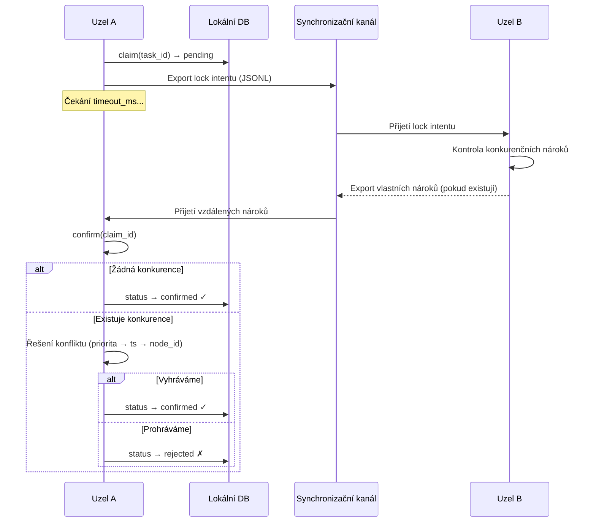
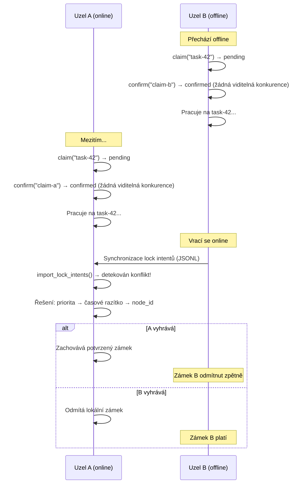
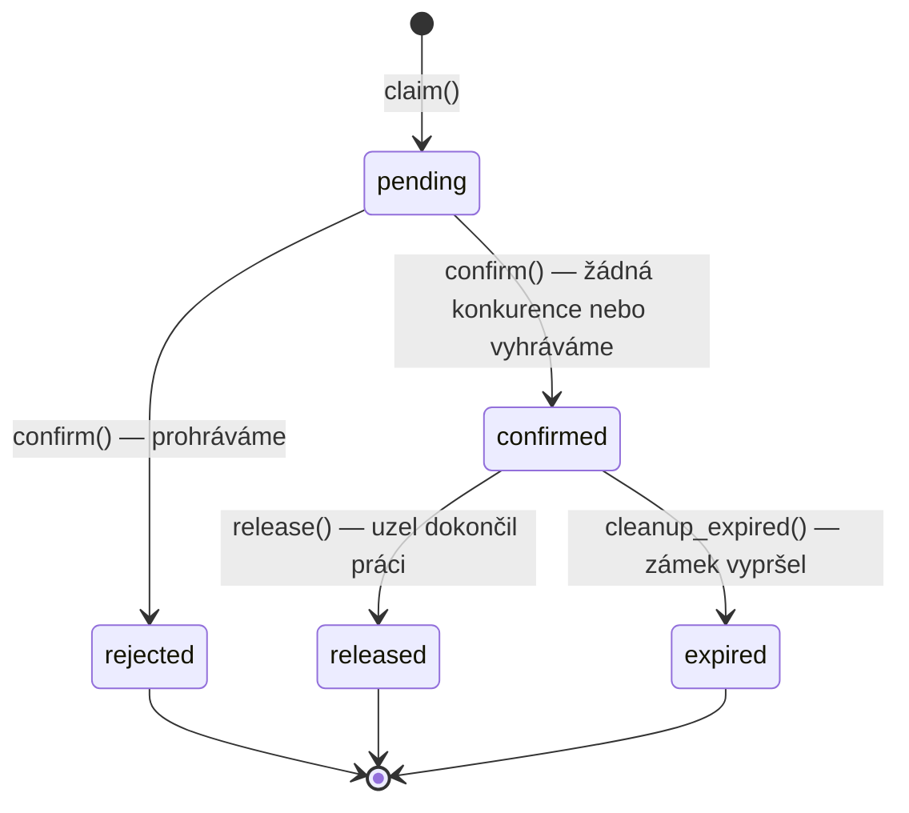

> ⚠️ **DESIGN ONLY** — This module is not implemented. This document describes a planned design.

# UAML Task Claim Protocol

> Distribuované zamykání úkolů s optimistickým řízením souběhu pro UAML uzly operující přes LAN, WAN i v offline prostředí.

## Přehled

Když více AI agentů pracuje na stejném projektu, hrozí duplicitní práce. Pokud Metod (VPS) i Cyril (notebook) oba vidí otevřený úkol — „Opravit obnovu SSL certifikátu" — a oba na něm začnou pracovat současně, dochází k plýtvání výpočetním výkonem, časem a potenciálně ke konfliktním výstupům.

Task Claim Protocol tomuto předchází pomocí **distribuovaného optimistického zamykání** — lehkého, offline-kompatibilního mechanismu, který uzlům umožňuje nárokovat si exkluzivní vlastnictví úkolů před zahájením práce.

**Principy návrhu:**

- **Optimistické zamykání** — nejdřív nárokuj, pak ověř (bez blokujících čekání)
- **Offline-kompatibilní** — nároky fungují lokálně i bez připojení
- **Deterministické řešení konfliktů** — priorita → časové razítko → node_id (žádná náhodnost)
- **Konfigurovatelné timeouty** — přizpůsobení pro LAN (1s), WAN (5s) nebo satelit (30s)
- **Automatické vypršení** — opuštěné zámky se samy uvolní
- **Kompletní auditní stopa** — každý nárok, potvrzení, odmítnutí a uvolnění je zalogováno

## Průběh protokolu

Protokol používá dvou-fázový cyklus nároku:



### Zjednodušený průběh

1. **Nárok (Claim)** — Uzel vytvoří čekající lock intent a uloží ho lokálně
2. **Rozeslání (Broadcast)** — Lock intent se exportuje jako JSONL pro ostatní uzly
3. **Čekání (Wait)** — Uzel čeká `timeout_ms` na příjem konkurenčních nároků
4. **Potvrzení/Odmítnutí (Confirm/Reject)** — Uzel zkontroluje konflikty a buď potvrdí, nebo odmítne svůj nárok

## TaskClaim — datová třída

```python
@dataclass
class TaskClaim:
    claim_id: str       # UUID — unikátní identifikátor nároku
    task_id: str        # Nárokovaný úkol
    node_id: str        # Nárokující uzel (např. "metod-vps")
    timestamp: str      # ISO 8601 UTC — okamžik vytvoření nároku
    status: str         # pending | confirmed | rejected | released | expired
    timeout_ms: int     # Milisekundy čekání na konkurenční nároky
    priority: int       # Priorita uzlu — vyšší vyhrává (výchozí: 0)
    expires_at: str     # ISO 8601 UTC — okamžik automatického vypršení zámku
```

### Popis polí

| Pole | Typ | Výchozí | Popis |
|------|-----|---------|-------|
| `claim_id` | str (UUID) | auto-generováno | Globálně unikátní identifikátor nároku |
| `task_id` | str | povinné | ID nárokovaného úkolu/záznamu |
| `node_id` | str | povinné | Identita nárokujícího uzlu |
| `timestamp` | str (ISO 8601) | aktuální UTC čas | Přesný okamžik vytvoření nároku |
| `status` | str | `"pending"` | Aktuální stav životního cyklu nároku |
| `timeout_ms` | int | `2000` | Jak dlouho čekat na konkurenční nároky před potvrzením |
| `priority` | int | `0` | Priorita uzlu — vyšší hodnoty vyhrávají řešení konfliktů |
| `expires_at` | str (ISO 8601) | timestamp + lock_duration | Kdy potvrzený zámek automaticky vyprší |

### Serializace

```python
# Do slovníku
claim_dict = claim.to_dict()

# Ze slovníku
claim = TaskClaim.from_dict(claim_dict)
```

## LockManager API

`LockManager` je hlavní rozhraní pro Task Claim Protocol.

### Konstruktor

```python
from uaml.sync import LockManager

manager = LockManager(
    store=memory_store,           # Instance MemoryStore
    node_id="metod-vps",          # Identita tohoto uzlu
    default_timeout_ms=2000,      # Timeout čekání na nároky (ms)
    lock_duration_minutes=60,     # Jak dlouho potvrzené zámky platí
)
```

### Metody

| Metoda | Signatura | Návratový typ | Popis |
|--------|-----------|---------------|-------|
| `claim` | `(task_id: str, priority: int = 0) → TaskClaim` | `TaskClaim` | Vytvoření čekajícího nároku. Ukládá se do tabulek `task_locks` a `lock_intents` |
| `confirm` | `(claim_id: str) → bool` | `bool` | Kontrola konkurenčních nároků a potvrzení nebo odmítnutí. Vrací True při potvrzení |
| `release` | `(task_id: str) → bool` | `bool` | Uvolnění potvrzeného zámku na úkolu. Uvolňuje pouze zámky vlastněné tímto uzlem |
| `is_locked` | `(task_id: str) → Optional[dict]` | `dict` nebo `None` | Kontrola, zda má úkol aktivní (potvrzený, nevypršený) zámek |
| `active_locks` | `() → list[dict]` | `list[dict]` | Seznam všech aktivních (potvrzených, nevypršených) zámků napříč uzly |
| `expired_locks` | `() → list[dict]` | `list[dict]` | Seznam potvrzených zámků, které překročily `expires_at` |
| `cleanup_expired` | `() → int` | `int` | Převedení všech vypršených zámků do stavu `'expired'`. Vrací počet |
| `resolve_conflict` | `(claims: list[TaskClaim]) → TaskClaim` | `TaskClaim` | Deterministické řešení konfliktu mezi více konkurenčními nároky |

## Řešení konfliktů

Když více uzlů nárokuje stejný úkol, konflikt se řeší deterministicky pomocí třístupňového rozhodování:

### Pořadí řešení

1. **Vyšší priorita vyhrává** — Uzlům lze přiřadit úrovně priority (např. VPS=10, notebook=5)
2. **Dřívější časové razítko vyhrává** — Při stejné prioritě vyhrává uzel, který si nárokoval dříve
3. **Nižší node_id vyhrává** — Při stejném časovém razítku (vzácné) rozhoduje lexikografické porovnání node ID

```python
# Implementace řešení
sorted_claims = sorted(
    claims,
    key=lambda c: (-c.priority, c.timestamp, c.node_id),
)
winner = sorted_claims[0]
```

### Příklad: Přepsání prioritou

```python
# Metod (VPS) má vyšší prioritu
claim_metod = manager_metod.claim("task-42", priority=10)
claim_cyril = manager_cyril.claim("task-42", priority=5)

# Metod vyhrává bez ohledu na časové razítko
winner = LockManager._resolve_conflict_static([claim_metod, claim_cyril])
assert winner.node_id == "metod-vps"
```

### Příklad: Rozhodnutí časovým razítkem

```python
# Stejná priorita — dřívější nárok vyhrává
claim_a = TaskClaim(task_id="task-42", node_id="alpha", timestamp="2026-03-14T10:00:00", priority=0)
claim_b = TaskClaim(task_id="task-42", node_id="beta", timestamp="2026-03-14T10:00:01", priority=0)

winner = LockManager._resolve_conflict_static([claim_a, claim_b])
assert winner.node_id == "alpha"  # O 1 sekundu dříve
```

## Konfigurovatelné timeouty

Parametr `timeout_ms` řídí, jak dlouho uzel čeká na konkurenční nároky před potvrzením. Měl by být nastaven podle síťového prostředí:

| Prostředí | Doporučený `timeout_ms` | Důvod |
|-----------|------------------------|-------|
| **LAN** | 1 000 (1s) | Sub-milisekundová latence, nároky se šíří okamžitě |
| **WAN** | 5 000 (5s) | Internetová latence, typický git push/pull cyklus |
| **Satelit / Offline** | 30 000 (30s) | Vysoká latence, přerušovaná konektivita |

```python
# LAN nasazení
manager_lan = LockManager(store, node_id="node-a", default_timeout_ms=1000)

# WAN nasazení
manager_wan = LockManager(store, node_id="node-b", default_timeout_ms=5000)

# Satelit / vysoká latence
manager_sat = LockManager(store, node_id="node-c", default_timeout_ms=30000)
```

### Doba platnosti zámku

Potvrzené zámky mají konfigurovatelné vypršení (`lock_duration_minutes`, výchozí: 60). Po vypršení přechází zámek do stavu `'expired'` při dalším volání `cleanup_expired()`. Toto zabraňuje permanentnímu zamčení úkolů, pokud uzel přejde do offline režimu.

## Offline chování

Protokol je navržen pro prostředí, kde uzly pravidelně přecházejí do offline režimu. Strategie je **optimistický lokální nárok se sloučením při znovupřipojení**.

### Offline scénář



### Zpětná detekce konfliktů

Když se offline uzly znovupřipojí a vymění si lock intenty přes `SyncEngine.import_lock_intents()`, konflikty se detekují zpětně. Platí stejné deterministické řešení — zámek prohrávajícího uzlu se označí jako `'rejected'`.

To znamená, že během offline období může dojít k určité duplicitní práci. Protokol toto minimalizuje tím, že řešení je deterministické a auditovatelné — tým přesně ví, co se stalo a kdo „vlastní" finální výsledek.

## Životní cyklus zámku



### Stavy

| Stav | Popis | Přechod |
|------|-------|---------|
| `pending` | Nárok vytvořen, čeká na potvrzení | → `confirmed` nebo `rejected` přes `confirm()` |
| `confirmed` | Zámek je aktivní — tento uzel vlastní úkol | → `released` přes `release()` nebo `expired` přes `cleanup_expired()` |
| `rejected` | Prohrál řešení konfliktu — jiný uzel vlastní úkol | Terminální |
| `released` | Uzel dokončil práci a uvolnil zámek | Terminální |
| `expired` | Doba platnosti zámku překročena bez uvolnění | Terminální |

### Databázové schéma

```sql
CREATE TABLE task_locks (
    id TEXT PRIMARY KEY,          -- claim_id (UUID)
    task_id TEXT NOT NULL,
    node_id TEXT NOT NULL,
    status TEXT NOT NULL DEFAULT 'pending',
    claimed_at TEXT,              -- ISO 8601
    confirmed_at TEXT,            -- ISO 8601 (nastaveno při potvrzení)
    released_at TEXT,             -- ISO 8601 (nastaveno při uvolnění/vypršení)
    expires_at TEXT,              -- ISO 8601
    priority INTEGER DEFAULT 0
);

CREATE TABLE lock_intents (
    id INTEGER PRIMARY KEY AUTOINCREMENT,
    claim_id TEXT NOT NULL,
    task_id TEXT NOT NULL,
    node_id TEXT NOT NULL,
    timestamp TEXT NOT NULL,
    timeout_ms INTEGER DEFAULT 2000,
    priority INTEGER DEFAULT 0,
    resolved INTEGER DEFAULT 0    -- 0 = nevyřešeno, 1 = vyřešeno
);
```

## Integrace se SyncEngine

Lock intenty se synchronizují mezi uzly přes stejný JSONL transport jako běžná data, s využitím dedikovaných metod na `SyncEngine`.

### Export lock intentů

```python
engine = SyncEngine(store, node_id="metod-vps", sync_dir="sync/")

# Export všech nevyřešených lock intentů
path = engine.export_lock_intents()
# → "sync/metod-vps_locks_2026-03-14T10-30-00+00-00.jsonl"

# Export pouze intentů od konkrétního času
path = engine.export_lock_intents(since="2026-03-14T09:00:00Z")
```

### Import lock intentů

```python
result = engine.import_lock_intents("sync/cyril-notebook_locks_2026-03-14.jsonl")
print(result)
# {
#   "imported": 3,
#   "conflicts": 1,
#   "skipped": 0,
#   "conflict_details": [
#     {
#       "task_id": "task-42",
#       "local_claim": "abc-123",
#       "remote_claim": "def-456",
#       "winner": "metod-vps"
#     }
#   ]
# }
```

### JSONL formát lock intentu

```json
{"id": "abc-123-def", "node": "metod-vps", "ts": "2026-03-14T10:00:00Z", "action": "claim", "entry_id": 0, "data": {"claim_id": "abc-123-def", "task_id": "task-42", "node_id": "metod-vps", "timeout_ms": 2000, "priority": 10, "resolved": 0}, "checksum": "sha256...", "table": "lock_intents"}
```

## Příklady použití

### Dva uzly nárokují stejný úkol

```python
from uaml import MemoryStore
from uaml.sync import SyncEngine, LockManager

# Nastavení
store_a = MemoryStore("metod.db")
store_b = MemoryStore("cyril.db")
manager_a = LockManager(store_a, node_id="metod-vps", default_timeout_ms=2000)
manager_b = LockManager(store_b, node_id="cyril-notebook", default_timeout_ms=2000)

# Oba uzly nárokují stejný úkol
claim_a = manager_a.claim("task-42", priority=10)
claim_b = manager_b.claim("task-42", priority=5)

# Výměna lock intentů přes SyncEngine
engine_a = SyncEngine(store_a, node_id="metod-vps", sync_dir="sync/")
engine_b = SyncEngine(store_b, node_id="cyril-notebook", sync_dir="sync/")

path_a = engine_a.export_lock_intents()
path_b = engine_b.export_lock_intents()

engine_b.import_lock_intents(path_a)
engine_a.import_lock_intents(path_b)

# Potvrzení nároků — Metod vyhrává (vyšší priorita)
assert manager_a.confirm(claim_a.claim_id) == True   # ✓ Potvrzeno
assert manager_b.confirm(claim_b.claim_id) == False  # ✗ Odmítnuto

# Metod pracuje na úkolu...
# Po dokončení:
manager_a.release("task-42")
```

### Offline scénář

```python
# Cyril přejde offline a optimisticky si nárokuje úkol
claim_offline = manager_b.claim("task-99", priority=5)

# Žádné viditelné konkurenční nároky — lokální potvrzení
assert manager_b.confirm(claim_offline.claim_id) == True
# Cyril pracuje na task-99 offline...

# Mezitím Metod také nárokuje a potvrzuje (neví o Cyrilově nároku)
claim_metod = manager_a.claim("task-99", priority=10)
assert manager_a.confirm(claim_metod.claim_id) == True

# Cyril se vrátí online — synchronizace lock intentů
path_b = engine_b.export_lock_intents()
result = engine_a.import_lock_intents(path_b)
# result["conflicts"] == 1
# result["conflict_details"][0]["winner"] == "metod-vps"

# Vyšší priorita Metoda vyhrává zpětné řešení
```

### Automatický úklid zámků

```python
# Periodické vyčištění vypršených zámků
expired_count = manager.cleanup_expired()
print(f"Uvolněno {expired_count} vypršených zámků")

# Kontrola aktivních zámků
active = manager.active_locks()
for lock in active:
    print(f"Úkol {lock['task_id']} zamčen uzlem {lock['node_id']} do {lock['expires_at']}")
```

## Integrace s dashboardem

Pro zobrazení „kdo na čem pracuje" v týmovém dashboardu použijte `active_locks()`:

```python
def get_work_status(manager: LockManager) -> list[dict]:
    """Získání aktuálních pracovních přiřazení pro zobrazení v dashboardu."""
    # Nejdřív vyčistit vypršené zámky
    manager.cleanup_expired()

    active = manager.active_locks()
    status = []
    for lock in active:
        status.append({
            "task_id": lock["task_id"],
            "worker": lock["node_id"],
            "since": lock["claimed_at"],
            "expires": lock["expires_at"],
            "priority": lock.get("priority", 0),
        })
    return status
```

### Příklad zobrazení v dashboardu

| Úkol | Pracovník | Od | Vyprší | Priorita |
|------|-----------|----|--------|----------|
| Oprava SSL obnovy | metod-vps | 2026-03-14 10:00 | 2026-03-14 11:00 | 10 |
| Aktualizace dokumentace | cyril-notebook | 2026-03-14 10:15 | 2026-03-14 11:15 | 5 |
| Migrace databáze | metod-vps | 2026-03-14 09:30 | 2026-03-14 10:30 | 10 |

### Kontrola před zahájením práce

```python
def start_work(manager: LockManager, task_id: str, priority: int = 0) -> bool:
    """Pokus o nárokování úkolu před zahájením práce."""
    # Kontrola, zda je úkol již zamčen
    existing = manager.is_locked(task_id)
    if existing:
        print(f"Úkol {task_id} je již zamčen uzlem {existing['node_id']}")
        return False

    # Nárok a potvrzení
    claim = manager.claim(task_id, priority=priority)
    # ... čekání timeout_ms ...
    if manager.confirm(claim.claim_id):
        print(f"Úkol {task_id} úspěšně nárokován")
        return True
    else:
        print(f"Nárok na úkol {task_id} odmítnut — jiný uzel má prioritu")
        return False
```

---

© 2026 GLG, a.s. All rights reserved.
