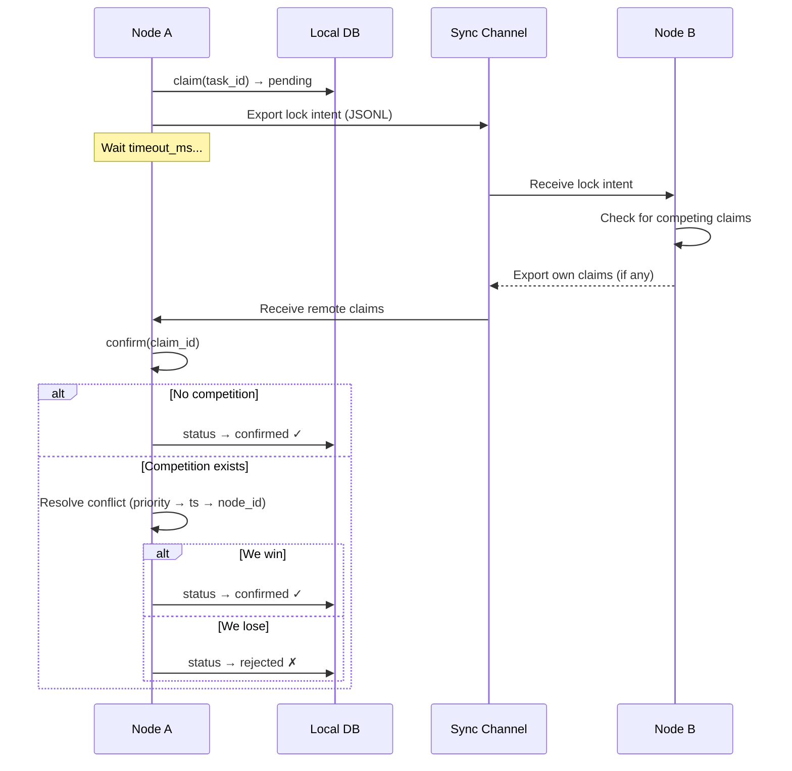
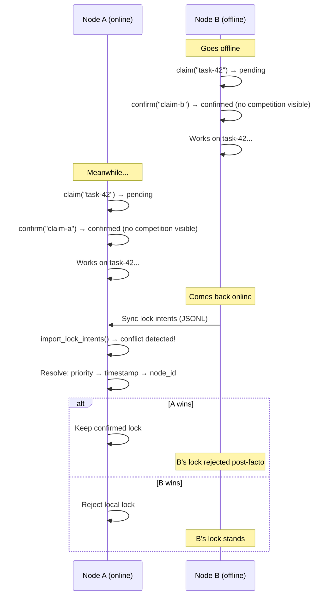
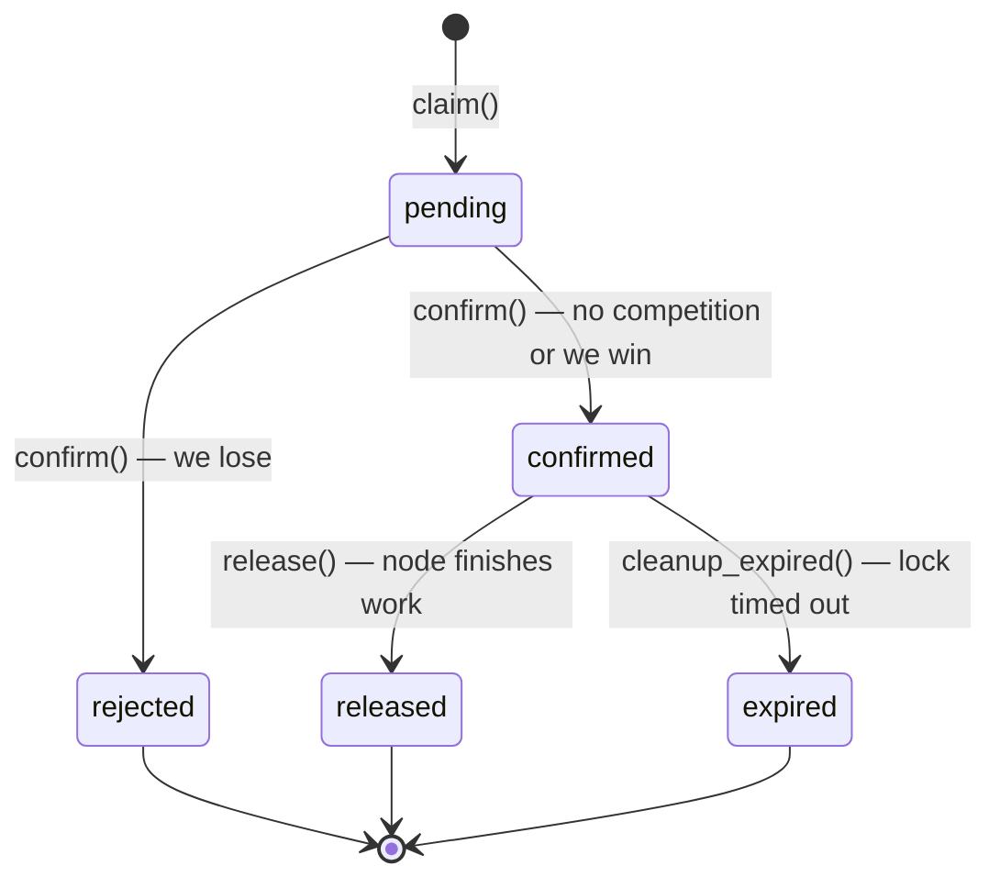

> ⚠️ **DESIGN ONLY** — This module is not implemented. This document describes a planned design.

# UAML Task Claim Protocol

> Distributed task locking with optimistic concurrency control for UAML nodes operating across LAN, WAN, and offline environments.

## Overview

When multiple AI agents work on the same project, they risk doing duplicate work. If Metod (VPS) and Cyril (notebook) both see an open task — "Fix SSL cert renewal" — and both start working on it simultaneously, you've wasted compute, time, and potentially created conflicting outputs.

The Task Claim Protocol prevents this by providing **distributed optimistic locking** — a lightweight, offline-compatible mechanism for nodes to claim exclusive ownership of tasks before starting work.

**Design principles:**

- **Optimistic locking** — claim first, verify later (no blocking waits)
- **Offline-compatible** — claims work locally even without connectivity
- **Deterministic conflict resolution** — priority → timestamp → node_id (no randomness)
- **Configurable timeouts** — adapts to LAN (1s), WAN (5s), or satellite (30s) latency
- **Automatic expiry** — abandoned locks release themselves
- **Full audit trail** — every claim, confirm, reject, and release is logged

## Protocol Flow

The protocol uses a two-phase claim cycle:



### Simplified Flow

1. **Claim** — Node creates a pending lock intent and stores it locally
2. **Broadcast** — Lock intent is exported via JSONL for other nodes
3. **Wait** — Node waits for `timeout_ms` to receive competing claims
4. **Confirm/Reject** — Node checks for conflicts and either confirms or rejects its own claim

## TaskClaim Dataclass

```python
@dataclass
class TaskClaim:
    claim_id: str       # UUID — unique claim identifier
    task_id: str        # The task being claimed
    node_id: str        # Claiming node (e.g., "metod-vps")
    timestamp: str      # ISO 8601 UTC — when claim was created
    status: str         # pending | confirmed | rejected | released | expired
    timeout_ms: int     # Milliseconds to wait for competing claims
    priority: int       # Node priority — higher wins ties (default: 0)
    expires_at: str     # ISO 8601 UTC — when the lock auto-expires
```

### Field Descriptions

| Field | Type | Default | Description |
|-------|------|---------|-------------|
| `claim_id` | str (UUID) | auto-generated | Globally unique identifier for this claim |
| `task_id` | str | required | ID of the task/entry being claimed |
| `node_id` | str | required | Identity of the claiming node |
| `timestamp` | str (ISO 8601) | current UTC time | Exact moment the claim was created |
| `status` | str | `"pending"` | Current lifecycle state of the claim |
| `timeout_ms` | int | `2000` | How long to wait for competing claims before confirming |
| `priority` | int | `0` | Node priority — higher values win conflict resolution |
| `expires_at` | str (ISO 8601) | timestamp + lock_duration | When the confirmed lock automatically expires |

### Serialization

```python
# To dictionary
claim_dict = claim.to_dict()

# From dictionary
claim = TaskClaim.from_dict(claim_dict)
```

## LockManager API

`LockManager` is the main interface for the Task Claim Protocol.

### Constructor

```python
from uaml.sync import LockManager

manager = LockManager(
    store=memory_store,           # MemoryStore instance
    node_id="metod-vps",          # This node's identity
    default_timeout_ms=2000,      # Claim wait timeout (ms)
    lock_duration_minutes=60,     # How long confirmed locks last
)
```

### Methods

| Method | Signature | Returns | Description |
|--------|-----------|---------|-------------|
| `claim` | `(task_id: str, priority: int = 0) → TaskClaim` | `TaskClaim` | Create a pending claim. Stores in `task_locks` and `lock_intents` tables |
| `confirm` | `(claim_id: str) → bool` | `bool` | Check for competing claims and confirm or reject. Returns True if confirmed |
| `release` | `(task_id: str) → bool` | `bool` | Release a confirmed lock on a task. Only releases locks owned by this node |
| `is_locked` | `(task_id: str) → Optional[dict]` | `dict` or `None` | Check if a task has an active (confirmed, non-expired) lock |
| `active_locks` | `() → list[dict]` | `list[dict]` | List all active (confirmed, non-expired) locks across all nodes |
| `expired_locks` | `() → list[dict]` | `list[dict]` | List confirmed locks that have passed their `expires_at` |
| `cleanup_expired` | `() → int` | `int` | Transition all expired locks to `'expired'` status. Returns count |
| `resolve_conflict` | `(claims: list[TaskClaim]) → TaskClaim` | `TaskClaim` | Deterministic conflict resolution across multiple competing claims |

## Conflict Resolution

When multiple nodes claim the same task, the conflict is resolved deterministically using a three-level tiebreaker:

### Resolution Order

1. **Higher priority wins** — Nodes can be assigned priority levels (e.g., VPS=10, notebook=5)
2. **Earlier timestamp wins** — If priorities are equal, the node that claimed first wins
3. **Lower node_id wins** — If timestamps are also equal (rare), lexicographic comparison of node IDs breaks the tie

```python
# Resolution implementation
sorted_claims = sorted(
    claims,
    key=lambda c: (-c.priority, c.timestamp, c.node_id),
)
winner = sorted_claims[0]
```

### Example: Priority Override

```python
# Metod (VPS) has higher priority
claim_metod = manager_metod.claim("task-42", priority=10)
claim_cyril = manager_cyril.claim("task-42", priority=5)

# Metod wins regardless of timestamp
winner = LockManager._resolve_conflict_static([claim_metod, claim_cyril])
assert winner.node_id == "metod-vps"
```

### Example: Timestamp Tiebreak

```python
# Same priority — earlier claim wins
claim_a = TaskClaim(task_id="task-42", node_id="alpha", timestamp="2026-03-14T10:00:00", priority=0)
claim_b = TaskClaim(task_id="task-42", node_id="beta", timestamp="2026-03-14T10:00:01", priority=0)

winner = LockManager._resolve_conflict_static([claim_a, claim_b])
assert winner.node_id == "alpha"  # 1 second earlier
```

## Configurable Timeouts

The `timeout_ms` parameter controls how long a node waits for competing claims before confirming. This should be tuned based on the network environment:

| Environment | Recommended `timeout_ms` | Rationale |
|-------------|-------------------------|-----------|
| **LAN** | 1,000 (1s) | Sub-millisecond latency, claims propagate instantly |
| **WAN** | 5,000 (5s) | Internet latency, typical git push/pull cycle |
| **Satellite / Offline** | 30,000 (30s) | High latency, intermittent connectivity |

```python
# LAN deployment
manager_lan = LockManager(store, node_id="node-a", default_timeout_ms=1000)

# WAN deployment
manager_wan = LockManager(store, node_id="node-b", default_timeout_ms=5000)

# Satellite / high-latency
manager_sat = LockManager(store, node_id="node-c", default_timeout_ms=30000)
```

### Lock Duration

Confirmed locks have a configurable expiry (`lock_duration_minutes`, default: 60). After expiry, the lock transitions to `'expired'` status on the next `cleanup_expired()` call. This prevents permanently locked tasks if a node goes offline.

## Offline Behavior

The protocol is designed for environments where nodes regularly go offline. The strategy is **optimistic local claim with merge-on-reconnect**.

### Offline Workflow



### Post-Facto Conflict Detection

When offline nodes reconnect and exchange lock intents via `SyncEngine.import_lock_intents()`, conflicts are detected retroactively. The same deterministic resolution applies — the losing node's lock is marked `'rejected'`.

This means some duplicate work may occur during offline periods. The protocol minimizes this by making the resolution deterministic and auditable, so the team knows exactly what happened and who "owns" the final result.

## Lock Lifecycle



### States

| State | Description | Transition |
|-------|-------------|------------|
| `pending` | Claim created, waiting for confirmation | → `confirmed` or `rejected` via `confirm()` |
| `confirmed` | Lock is active — this node owns the task | → `released` via `release()` or `expired` via `cleanup_expired()` |
| `rejected` | Lost conflict resolution — another node owns the task | Terminal |
| `released` | Node finished work and released the lock | Terminal |
| `expired` | Lock duration exceeded without release | Terminal |

### Database Schema

```sql
CREATE TABLE task_locks (
    id TEXT PRIMARY KEY,          -- claim_id (UUID)
    task_id TEXT NOT NULL,
    node_id TEXT NOT NULL,
    status TEXT NOT NULL DEFAULT 'pending',
    claimed_at TEXT,              -- ISO 8601
    confirmed_at TEXT,            -- ISO 8601 (set on confirm)
    released_at TEXT,             -- ISO 8601 (set on release/expire)
    expires_at TEXT,              -- ISO 8601
    priority INTEGER DEFAULT 0
);

CREATE TABLE lock_intents (
    id INTEGER PRIMARY KEY AUTOINCREMENT,
    claim_id TEXT NOT NULL,
    task_id TEXT NOT NULL,
    node_id TEXT NOT NULL,
    timestamp TEXT NOT NULL,
    timeout_ms INTEGER DEFAULT 2000,
    priority INTEGER DEFAULT 0,
    resolved INTEGER DEFAULT 0    -- 0 = unresolved, 1 = resolved
);
```

## Integration with SyncEngine

Lock intents are synchronized between nodes via the same JSONL transport as regular data, using dedicated methods on `SyncEngine`.

### Export Lock Intents

```python
engine = SyncEngine(store, node_id="metod-vps", sync_dir="sync/")

# Export all unresolved lock intents
path = engine.export_lock_intents()
# → "sync/metod-vps_locks_2026-03-14T10-30-00+00-00.jsonl"

# Export only intents since a specific time
path = engine.export_lock_intents(since="2026-03-14T09:00:00Z")
```

### Import Lock Intents

```python
result = engine.import_lock_intents("sync/cyril-notebook_locks_2026-03-14.jsonl")
print(result)
# {
#   "imported": 3,
#   "conflicts": 1,
#   "skipped": 0,
#   "conflict_details": [
#     {
#       "task_id": "task-42",
#       "local_claim": "abc-123",
#       "remote_claim": "def-456",
#       "winner": "metod-vps"
#     }
#   ]
# }
```

### JSONL Lock Intent Format

```json
{"id": "abc-123-def", "node": "metod-vps", "ts": "2026-03-14T10:00:00Z", "action": "claim", "entry_id": 0, "data": {"claim_id": "abc-123-def", "task_id": "task-42", "node_id": "metod-vps", "timeout_ms": 2000, "priority": 10, "resolved": 0}, "checksum": "sha256...", "table": "lock_intents"}
```

## Usage Examples

### Two Nodes Claiming the Same Task

```python
from uaml import MemoryStore
from uaml.sync import SyncEngine, LockManager

# Setup
store_a = MemoryStore("metod.db")
store_b = MemoryStore("cyril.db")
manager_a = LockManager(store_a, node_id="metod-vps", default_timeout_ms=2000)
manager_b = LockManager(store_b, node_id="cyril-notebook", default_timeout_ms=2000)

# Both nodes claim the same task
claim_a = manager_a.claim("task-42", priority=10)
claim_b = manager_b.claim("task-42", priority=5)

# Exchange lock intents via SyncEngine
engine_a = SyncEngine(store_a, node_id="metod-vps", sync_dir="sync/")
engine_b = SyncEngine(store_b, node_id="cyril-notebook", sync_dir="sync/")

path_a = engine_a.export_lock_intents()
path_b = engine_b.export_lock_intents()

engine_b.import_lock_intents(path_a)
engine_a.import_lock_intents(path_b)

# Confirm claims — Metod wins (higher priority)
assert manager_a.confirm(claim_a.claim_id) == True   # ✓ Confirmed
assert manager_b.confirm(claim_b.claim_id) == False  # ✗ Rejected

# Metod works on the task...
# When done:
manager_a.release("task-42")
```

### Offline Scenario

```python
# Cyril goes offline and claims a task optimistically
claim_offline = manager_b.claim("task-99", priority=5)

# No competing claims visible — confirm locally
assert manager_b.confirm(claim_offline.claim_id) == True
# Cyril works on task-99 while offline...

# Meanwhile, Metod also claims and confirms (no knowledge of Cyril's claim)
claim_metod = manager_a.claim("task-99", priority=10)
assert manager_a.confirm(claim_metod.claim_id) == True

# Cyril comes back online — sync lock intents
path_b = engine_b.export_lock_intents()
result = engine_a.import_lock_intents(path_b)
# result["conflicts"] == 1
# result["conflict_details"][0]["winner"] == "metod-vps"

# Metod's higher priority wins the post-facto resolution
```

### Automatic Lock Cleanup

```python
# Periodically clean up expired locks
expired_count = manager.cleanup_expired()
print(f"Released {expired_count} expired locks")

# Check active locks
active = manager.active_locks()
for lock in active:
    print(f"Task {lock['task_id']} locked by {lock['node_id']} until {lock['expires_at']}")
```

## Dashboard Integration

To show "who is working on what" in a team dashboard, use `active_locks()`:

```python
def get_work_status(manager: LockManager) -> list[dict]:
    """Get current work assignments for dashboard display."""
    # Clean up expired locks first
    manager.cleanup_expired()

    active = manager.active_locks()
    status = []
    for lock in active:
        status.append({
            "task_id": lock["task_id"],
            "worker": lock["node_id"],
            "since": lock["claimed_at"],
            "expires": lock["expires_at"],
            "priority": lock.get("priority", 0),
        })
    return status
```

### Dashboard Display Example

| Task | Worker | Since | Expires | Priority |
|------|--------|-------|---------|----------|
| Fix SSL renewal | metod-vps | 2026-03-14 10:00 | 2026-03-14 11:00 | 10 |
| Update docs | cyril-notebook | 2026-03-14 10:15 | 2026-03-14 11:15 | 5 |
| DB migration | metod-vps | 2026-03-14 09:30 | 2026-03-14 10:30 | 10 |

### Checking Before Starting Work

```python
def start_work(manager: LockManager, task_id: str, priority: int = 0) -> bool:
    """Attempt to claim a task before starting work."""
    # Check if already locked
    existing = manager.is_locked(task_id)
    if existing:
        print(f"Task {task_id} already locked by {existing['node_id']}")
        return False

    # Claim and confirm
    claim = manager.claim(task_id, priority=priority)
    # ... wait for timeout_ms ...
    if manager.confirm(claim.claim_id):
        print(f"Task {task_id} claimed successfully")
        return True
    else:
        print(f"Task {task_id} claim rejected — another node has priority")
        return False
```

---

© 2026 GLG, a.s. All rights reserved.
